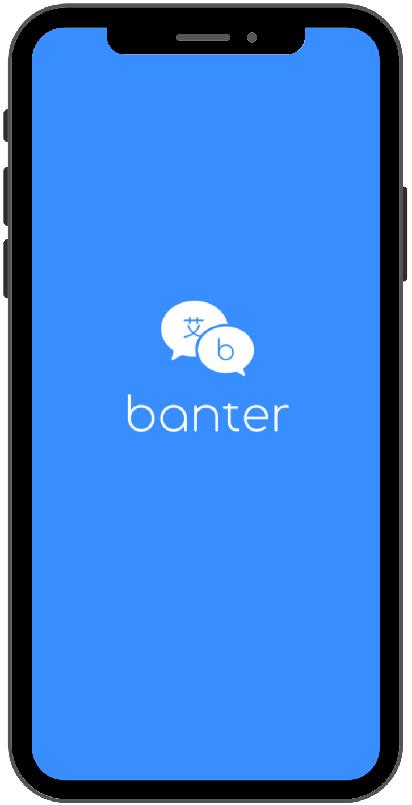

# Graze

_Instagram Clone Mobile App_

Banter is a mobile app built with two teammates for our final Capstone project at Fullstack Academy. As technology continues to enable us to connect with people from around the world, we decided to create Banter, a chat translation app, to aid in this connectivity by allowing people to communicate in different languages without any barriers.

The app uses Google Cloud Translate API to translate text from the sender's language to the receiver's language in realtime. It also leverages Google Cloud Speech-to-Text API to allow users to record voice notes that can then be turned into text and translated.

## Tech Stack

We used React Native, Expo, React Navigation, and Firebase for the basis of Banter.

To store authentication, messages, chatrooms, contacts, voice texts and other user data, we used Firebase Authentication, Storage and Realtime Database, a NoSQL database.

For the voice text functionality, we used Expo's AV Package, which enables audio and voice capabilities, like recording and playback. To store and transcribe voice recordings, we set up a Cloud Function that ran the recording through Cloud Speech-to-Text API and returned a text copy of the voice note. This was then stored on our user chats and translated as a text message via Cloud Translate API.

To manage our state throughout the app's various screens, we used Redux, which helped to maintain a single source of truth.

## Screenshots

_Splash Screen_

_Add Contact Screen_

_Contacts Screen_

_Voice Note_

<!--  -->

---

Check out our full presentation and app demo [here](https://www.youtube.com/watch?v=9VvuTD-Mtn4&list=PLx0iOsdUOUmnf7I22qeTz8ms5tPM14dgg&index=21&t=0s)

---

Images provided by [Unsplash](https://unsplash.com/)
